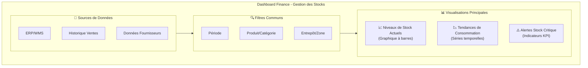
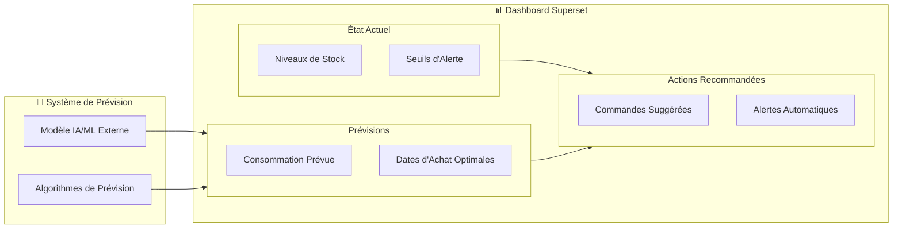
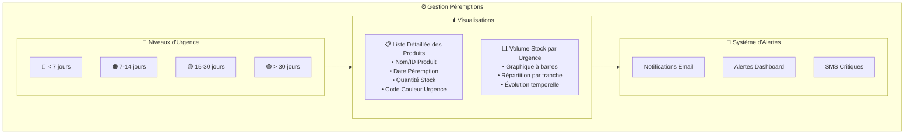
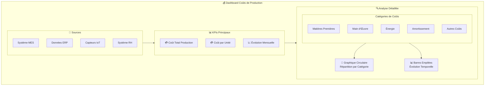
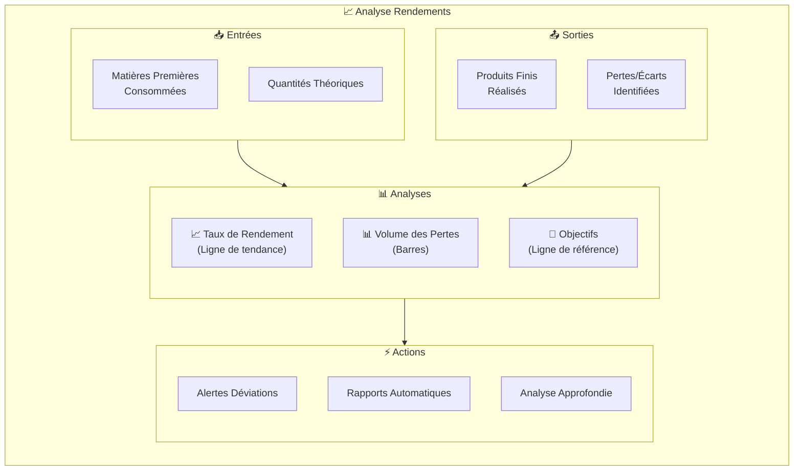
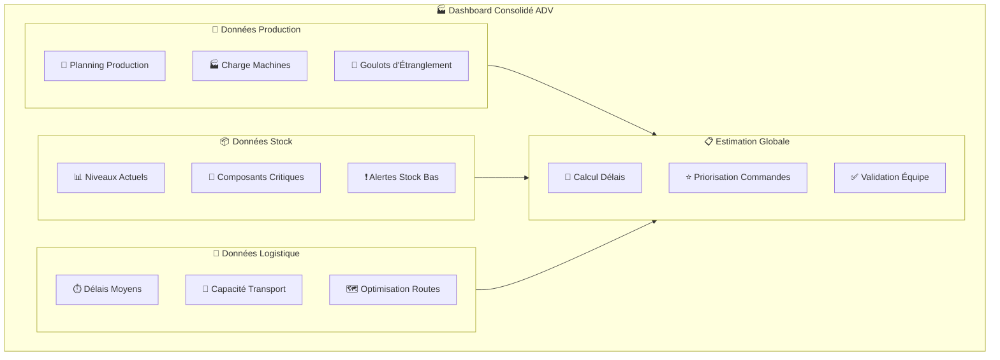
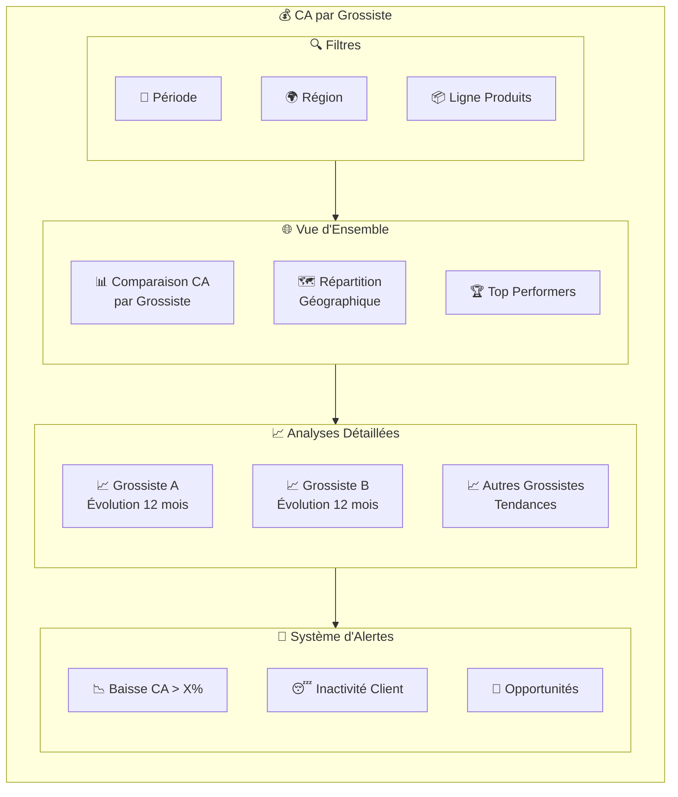
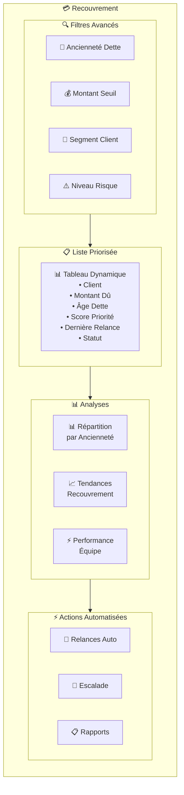
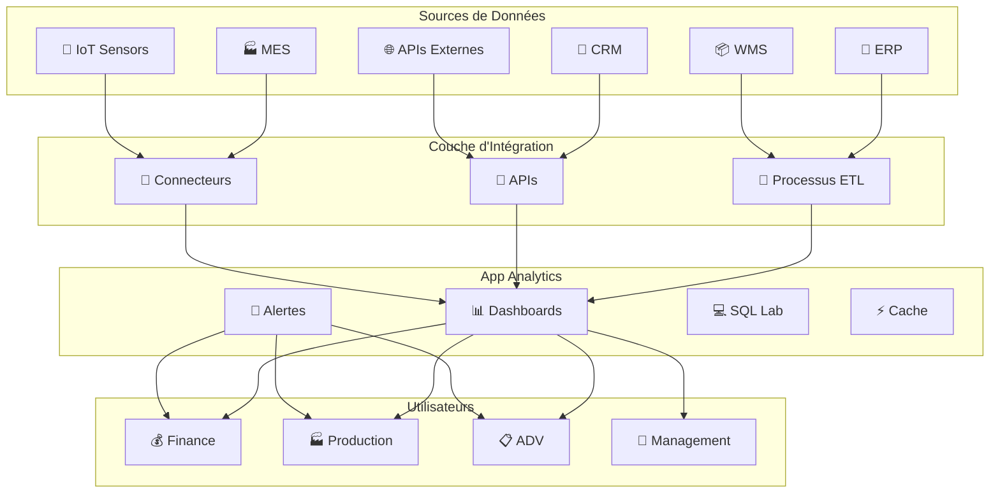

# Rapport : Exploiter App Analytics pour Répondre aux Besoins Métiers

## Résumé Exécutif

App Analytics est une plateforme open-source moderne de visualisation de données et de business intelligence. Ce rapport présente une stratégie d'implémentation pour répondre aux besoins spécifiques des départements Finance, Production et Administration des Ventes (ADV) par le déploiement de tableaux de bord interactifs et d'alertes automatisées.

## Table des Matières

1. [Introduction](#introduction)
2. [Département Finance](#département-finance--optimisation-et-prévention)
3. [Département Production](#département-production--maîtrise-des-coûts-et-optimisation-des-rendements)
4. [Administration des Ventes (ADV)](#administration-des-ventes-adv--automatisation-et-suivi-client)
5. [Conclusion](#conclusion)

---

## Introduction

App Analytics offre la capacité de concevoir des tableaux de bord interactifs et des rapports analytiques en s'appuyant sur une multitude de sources de données. Cette plateforme permet de transformer les données brutes en insights actionnables pour optimiser les processus métiers.

**Avantages clés d'App Analytics :**
- Interface intuitive et moderne
- Connectivité étendue aux sources de données
- Système d'alertes et de rapports automatisés
- Capacités de drill-down et d'analyse approfondie

---

## Département Finance : Optimisation et Prévention

### Objectifs Stratégiques
- Optimisation de la gestion des stocks
- Réduction des pertes liées à la péremption
- Amélioration de la prévision des besoins

### 1. Système de Gestion de Stock Intelligent

#### Suivi des Niveaux de Stock et Consommation

**Architecture du tableau de bord :**

#### Prévisions et Recommandations d'Achat

#### Gestion de la Péremption

**Tableau de bord de suivi des péremptions :**

---

## Département Production : Maîtrise des Coûts et Optimisation des Rendements

### Objectifs Stratégiques
- Calcul automatisé des coûts de production
- Amélioration des rendements matière
- Optimisation des processus de fabrication

### 1. Calcul Automatisé du Coût de Production

### 2. Suivi du Rendement Matière

---

## Administration des Ventes (ADV) : Automatisation et Suivi Client

### Objectifs Stratégiques
- Automatisation du traitement des commandes
- Prévision précise des délais de livraison
- Optimisation du suivi client et du recouvrement

### 1. Traitement de Commande et Prévision des Délais

### 2. Analyse du Chiffre d'Affaires par Grossiste

### 3. Suivi Intelligent des Relances Clients

---

## Architecture Technique Recommandée

### Intégrations de Données

## Plan de Déploiement

### Phase 1 : Fondations (Mois 1-2)
- Installation et configuration d'App Analytics
- Connexion aux sources de données principales (ERP, WMS)
- Formation de l'équipe technique

### Phase 2 : Finance (Mois 2-3)
- Déploiement des dashboards de gestion des stocks
- Configuration des alertes de péremption
- Tests et ajustements avec l'équipe Finance

### Phase 3 : Production (Mois 3-4)
- Mise en place du suivi des coûts de production
- Implémentation de l'analyse des rendements
- Intégration des données MES et IoT

### Phase 4 : ADV (Mois 4-5)
- Déploiement des outils de suivi des commandes
- Configuration de l'analyse du CA par grossiste
- Mise en place du système de recouvrement

### Phase 5 : Optimisation (Mois 5-6)
- Optimisation des performances
- Formation des utilisateurs finaux
- Documentation et procédures

## Bénéfices Attendus

### Quantifiables
- **Réduction des pertes par péremption** : -15 à 25%
- **Optimisation des stocks** : -10 à 20% de stock immobilisé
- **Amélioration des délais de livraison** : +95% de respect des délais
- **Réduction des créances clients** : -20 à 30% de DSO

### Qualitatifs
- Amélioration de la prise de décision
- Réactivité accrue aux variations du marché
- Meilleure collaboration inter-départements
- Standardisation des processus de reporting

---

## Conclusion

App Analytics se révèle être une plateforme stratégique pour la transformation digitale de l'entreprise. En centralisant la visualisation des données et en automatisant les alertes, elle permet :

1. **Une meilleure visibilité** sur les opérations critiques
2. **Une réactivité accrue** face aux événements business
3. **Une optimisation continue** des processus métiers
4. **Une démocratisation** de l'accès aux données

L'implémentation progressive proposée assure une adoption réussie tout en minimisant les risques. Le ROI attendu justifie largement l'investissement, tant en termes de gains opérationnels que d'amélioration de la compétitivité.

**Prochaines étapes recommandées :**
- Validation du plan de déploiement par les parties prenantes
- Allocation des ressources techniques et humaines
- Lancement de la phase pilote avec le département Finance
- Planification de la conduite du changement
