# Rapport : Exploiter App Analytics pour Répondre aux Besoins Métiers

## Résumé Exécutif

App Analytics est une plateforme open-source moderne de visualisation de données et de business intelligence. Ce rapport présente une stratégie d'implémentation pour répondre aux besoins spécifiques des départements Finance, Production et Administration des Ventes (ADV) par le déploiement de tableaux de bord interactifs et d'alertes automatisées.

## Table des Matières

1. [Introduction](#introduction)
2. [Département Finance](#département-finance--optimisation-et-prévention)
3. [Département Production](#département-production--maîtrise-des-coûts-et-optimisation-des-rendements)
4. [Administration des Ventes (ADV)](#administration-des-ventes-adv--automatisation-et-suivi-client)
5. [Conclusion](#conclusion)

---

## Introduction

App Analytics offre la capacité de concevoir des tableaux de bord interactifs et des rapports analytiques en s'appuyant sur une multitude de sources de données. Cette plateforme permet de transformer les données brutes en insights actionnables pour optimiser les processus métiers.

**Avantages clés d'App Analytics :**
- Interface intuitive et moderne
- Connectivité étendue aux sources de données
- Système d'alertes et de rapports automatisés
- Capacités de drill-down et d'analyse approfondie

---

## Département Finance : Optimisation et Prévention

### Objectifs Stratégiques
- Optimisation de la gestion des stocks
- Réduction des pertes liées à la péremption
- Amélioration de la prévision des besoins

### 1. Système de Gestion de Stock Intelligent

#### Suivi des Niveaux de Stock et Consommation

**Architecture du tableau de bord :**

```mermaid
graph TB
    subgraph "Dashboard Finance - Gestion des Stocks"
        subgraph Filtres["🔍 Filtres Communs"]
            F1[Période]
            F2[Produit/Catégorie]
            F3[Entrepôt/Zone]
        end
        
        subgraph Visualisations["📊 Visualisations Principales"]
            V1["📈 Niveaux de Stock Actuels<br/>(Graphique à barres)"]
            V2["📉 Tendances de Consommation<br/>(Séries temporelles)"]
            V3["⚠️ Alertes Stock Critique<br/>(Indicateurs KPI)"]
        end
        
        subgraph Sources["💾 Sources de Données"]
            S1[ERP/WMS]
            S2[Historique Ventes]
            S3[Données Fournisseurs]
        end
    end
    
    Sources --> Filtres
    Filtres --> Visualisations
```

#### Prévisions et Recommandations d'Achat

```mermaid
graph LR
    subgraph "🤖 Système de Prévision"
        IA[Modèle IA/ML Externe]
        ALG[Algorithmes de Prévision]
    end
    
    subgraph "📊 Dashboard Superset"
        subgraph Current["État Actuel"]
            STOCK[Niveaux de Stock]
            SEUIL[Seuils d'Alerte]
        end
        
        subgraph Forecast["Prévisions"]
            PREV[Consommation Prévue]
            DATES[Dates d'Achat Optimales]
        end
        
        subgraph Actions["Actions Recommandées"]
            CMD[Commandes Suggérées]
            ALERT[Alertes Automatiques]
        end
    end
    
    IA --> Forecast
    ALG --> Forecast
    Current --> Actions
    Forecast --> Actions
```

#### Gestion de la Péremption

**Tableau de bord de suivi des péremptions :**

```mermaid
graph TD
    subgraph "⏰ Gestion Péremptions"
        subgraph Urgence["🚨 Niveaux d'Urgence"]
        direction TB
            U1[🔴 < 7 jours]
            U2[🟠 7-14 jours] 
            U3[🟡 15-30 jours]
            U4[🟢 > 30 jours]
        end
        
        subgraph Visualisations["📊 Visualisations"]
        direction TB
            TABLE["📋 Liste Détaillée des Produits<br/>• Nom/ID Produit<br/>• Date Péremption<br/>• Quantité Stock<br/>• Code Couleur Urgence"]
            
            CHART["📊 Volume Stock par Urgence<br/>• Graphique à barres<br/>• Répartition par tranche<br/>• Évolution temporelle"]
        end
        
        subgraph Alertes["🔔 Système d'Alertes"]
        direction TB
            EMAIL[Notifications Email]
            DASH[Alertes Dashboard]
            SMS[SMS Critiques]
        end
    end
    
    Urgence --> Visualisations
    Visualisations --> Alertes
```

---

## Département Production : Maîtrise des Coûts et Optimisation des Rendements

### Objectifs Stratégiques
- Calcul automatisé des coûts de production
- Amélioration des rendements matière
- Optimisation des processus de fabrication

### 1. Calcul Automatisé du Coût de Production

```mermaid
graph TB
    subgraph "💰 Dashboard Coûts de Production"
        subgraph KPIs["📊 KPIs Principaux"]
            K1[💳 Coût Total Production]
            K2[💳 Coût par Unité]
            K3[📈 Évolution Mensuelle]
        end
        
        subgraph Analyse["🔍 Analyse Détaillée"]
            subgraph Categories["Catégories de Coûts"]
                C1[Matières Premières]
                C2[Main d'Œuvre]
                C3[Énergie]
                C4[Amortissement]
                C5[Autres Coûts]
            end
            
            PIE["🥧 Graphique Circulaire<br/>Répartition par Catégorie"]
            STACK["📊 Barres Empilées<br/>Évolution Temporelle"]
        end
        
        subgraph Sources["💾 Sources"]
            MES[Système MES]
            ERP[Données ERP]
            IOT[Capteurs IoT]
            RH[Système RH]
        end
    end
    
    Sources --> KPIs
    Categories --> PIE
    Categories --> STACK
    KPIs --> Analyse
```

### 2. Suivi du Rendement Matière

```mermaid
graph LR
    subgraph "📈 Analyse Rendements"
        subgraph Input["📥 Entrées"]
            direction TB
            MAT[Matières Premières<br/>Consommées]
            QTE[Quantités Théoriques]
        end
        
        subgraph Output["📤 Sorties"]
            direction TB
            PROD[Produits Finis<br/>Réalisés]
            PERT[Pertes/Écarts<br/>Identifiées]
        end
        
        subgraph Analysis["📊 Analyses"]
            direction TB
            REND["📈 Taux de Rendement<br/>(Ligne de tendance)"] 
            VOL["📊 Volume des Pertes<br/>(Barres)"]         
            TARGET["🎯 Objectifs<br/>(Ligne de référence)"] 
        end
        
        subgraph Actions["⚡ Actions"]
            direction TB
            ALERT[Alertes Déviations]
            REPORT[Rapports Automatiques]
            DRILL[Analyse Approfondie]
        end
    end
    
    Input --> Analysis
    Output --> Analysis
    Analysis --> Actions
```

---

## Administration des Ventes (ADV) : Automatisation et Suivi Client

### Objectifs Stratégiques
- Automatisation du traitement des commandes
- Prévision précise des délais de livraison
- Optimisation du suivi client et du recouvrement

### 1. Traitement de Commande et Prévision des Délais

```mermaid
graph TB
    subgraph "🏭 Dashboard Consolidé ADV"
        subgraph Production["🔧 Données Production"]
            PLAN[📅 Planning Production]
            CHARGE[🏭 Charge Machines]
            GOULOT[🚦 Goulots d'Étranglement]
        end
        
        subgraph Stock["📦 Données Stock"]
            NIVEAU[📊 Niveaux Actuels]
            COMPO[🔩 Composants Critiques]
            ALERTE[❗ Alertes Stock Bas]
        end
        
        subgraph Logistique["🚚 Données Logistique"]
            DELAI[⏱️ Délais Moyens]
            TRANSPORT[🚛 Capacité Transport]
            ROUTE[🗺️ Optimisation Routes]
        end
        
        subgraph Estimation["📋 Estimation Globale"]
            CALC[🧮 Calcul Délais]
            PRIO[⭐ Priorisation Commandes]
            VALID[✅ Validation Équipe]
        end
    end
    
    Production --> Estimation
    Stock --> Estimation
    Logistique --> Estimation
```

### 2. Analyse du Chiffre d'Affaires par Grossiste

```mermaid
graph LR
    subgraph "💰 CA par Grossiste"
        subgraph Filtres["🔍 Filtres"]
            direction TB
            F1[📅 Période]
            F2[🌍 Région]
            F3[📦 Ligne Produits]
        end
        
        subgraph VueGlobale["🌐 Vue d'Ensemble"]
            direction TB
            COMP["📊 Comparaison CA<br/>par Grossiste"]
            MAP["🗺️ Répartition<br/>Géographique"]
            TOP["🏆 Top Performers"]
        end
        
        subgraph Tendances["📈 Analyses Détaillées"]
            direction TB
            G1["📈 Grossiste A<br/>Évolution 12 mois"]
            G2["📈 Grossiste B<br/>Évolution 12 mois"]
            G3["📈 Autres Grossistes<br/>Tendances"]
        end
        
        subgraph Alertes["🚨 Système d'Alertes"]
            direction TB
            BAISSE["📉 Baisse CA > X%"]
            INACTIF["😴 Inactivité Client"]
            OPPORTUN["🎯 Opportunités"]
        end
    end
    
    Filtres --> VueGlobale
    VueGlobale --> Tendances
    Tendances --> Alertes
```

### 3. Suivi Intelligent des Relances Clients

```mermaid
graph LR
    subgraph "💳 Recouvrement"
        subgraph Filtres["🔍 Filtres Avancés"]
        
            AGE[📅 Ancienneté Dette]
            MONT[💰 Montant Seuil]
            SEG[👥 Segment Client]
            RISK[⚠️ Niveau Risque]
        end
        
        subgraph Liste["📋 Liste Priorisée"]
            TABLE["📊 Tableau Dynamique<br/>• Client<br/>• Montant Dû<br/>• Âge Dette<br/>• Score Priorité<br/>• Dernière Relance<br/>• Statut"]
        end
        
        subgraph Analyse["📊 Analyses"]
            REPART["📊 Répartition<br/>par Ancienneté"]
            TREND["📈 Tendances<br/>Recouvrement"]
            PERF["⚡ Performance<br/>Équipe"]
        end
        
        subgraph Actions["⚡ Actions Automatisées"]
            RELANCE[📧 Relances Auto]
            ESCAL[🚨 Escalade]
            REPORT[📋 Rapports]
        end
    end
    
    Filtres --> Liste
    Liste --> Analyse
    Analyse --> Actions
```

---

## Architecture Technique Recommandée

### Intégrations de Données

```mermaid
graph TB
    subgraph "Sources de Données"
        ERP[💼 ERP]
        WMS[📦 WMS]
        MES[🏭 MES]
        CRM[👥 CRM]
        IOT[🔌 IoT Sensors]
        EXT[🌐 APIs Externes]
    end
    
    subgraph "Couche d'Intégration"
        ETL[🔄 Processus ETL]
        API[🔗 APIs]
        CONN[🔌 Connecteurs]
    end
    
    subgraph "App Analytics"
        DASH[📊 Dashboards]
        ALERT[🔔 Alertes]
        SQL[💻 SQL Lab]
        CACHE[⚡ Cache]
    end
    
    subgraph "Utilisateurs"
        FIN[💰 Finance]
        PROD[🏭 Production]
        ADV[📋 ADV]
        MGT[👔 Management]
    end
    
    ERP --> ETL
    WMS --> ETL
    MES --> CONN
    CRM --> API
    IOT --> CONN
    EXT --> API
    
    ETL --> DASH
    API --> DASH
    CONN --> DASH
    
    DASH --> FIN
    DASH --> PROD
    DASH --> ADV
    DASH --> MGT
    
    ALERT --> FIN
    ALERT --> PROD
    ALERT --> ADV
```

## Plan de Déploiement

### Phase 1 : Fondations (Mois 1-2)
- Installation et configuration d'App Analytics
- Connexion aux sources de données principales (ERP, WMS)
- Formation de l'équipe technique

### Phase 2 : Finance (Mois 2-3)
- Déploiement des dashboards de gestion des stocks
- Configuration des alertes de péremption
- Tests et ajustements avec l'équipe Finance

### Phase 3 : Production (Mois 3-4)
- Mise en place du suivi des coûts de production
- Implémentation de l'analyse des rendements
- Intégration des données MES et IoT

### Phase 4 : ADV (Mois 4-5)
- Déploiement des outils de suivi des commandes
- Configuration de l'analyse du CA par grossiste
- Mise en place du système de recouvrement

### Phase 5 : Optimisation (Mois 5-6)
- Optimisation des performances
- Formation des utilisateurs finaux
- Documentation et procédures

## Bénéfices Attendus

### Quantifiables
- **Réduction des pertes par péremption** : -15 à 25%
- **Optimisation des stocks** : -10 à 20% de stock immobilisé
- **Amélioration des délais de livraison** : +95% de respect des délais
- **Réduction des créances clients** : -20 à 30% de DSO

### Qualitatifs
- Amélioration de la prise de décision
- Réactivité accrue aux variations du marché
- Meilleure collaboration inter-départements
- Standardisation des processus de reporting

---

## Conclusion

App Analytics se révèle être une plateforme stratégique pour la transformation digitale de l'entreprise. En centralisant la visualisation des données et en automatisant les alertes, elle permet :

1. **Une meilleure visibilité** sur les opérations critiques
2. **Une réactivité accrue** face aux événements business
3. **Une optimisation continue** des processus métiers
4. **Une démocratisation** de l'accès aux données

L'implémentation progressive proposée assure une adoption réussie tout en minimisant les risques. Le ROI attendu justifie largement l'investissement, tant en termes de gains opérationnels que d'amélioration de la compétitivité.

**Prochaines étapes recommandées :**
- Validation du plan de déploiement par les parties prenantes
- Allocation des ressources techniques et humaines
- Lancement de la phase pilote avec le département Finance
- Planification de la conduite du changement
